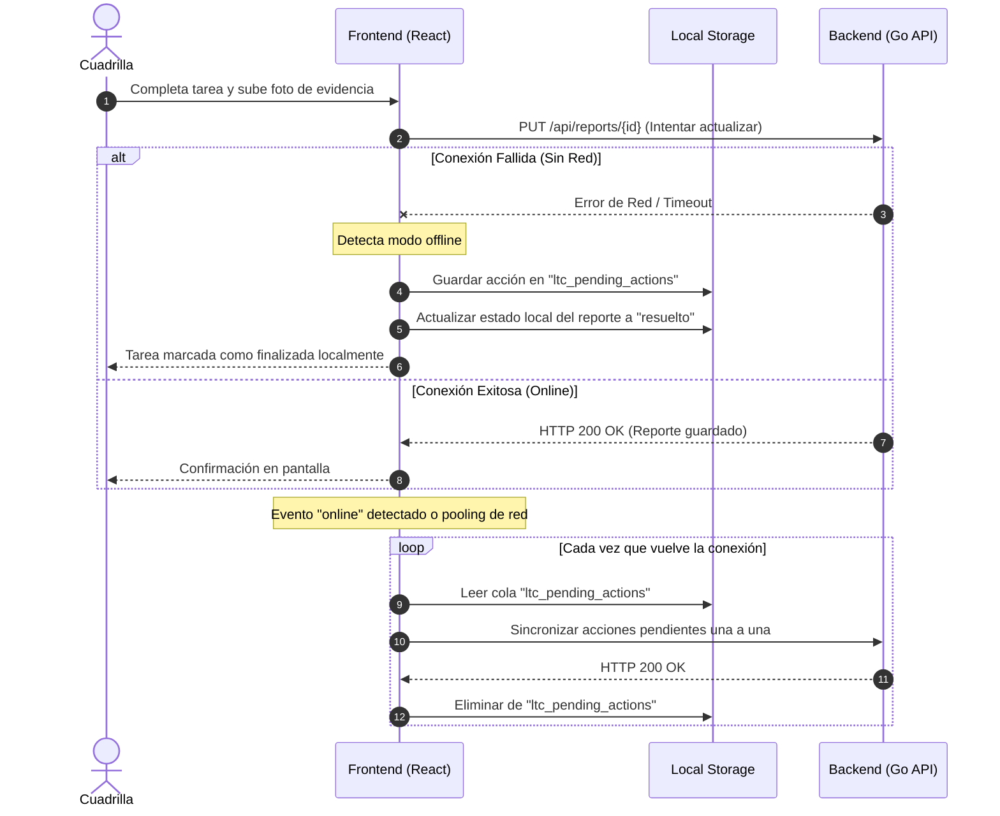

# Manual Técnico
## Plataforma "LimpiaTuCiudad"

Este documento contiene la especificación técnica de la plataforma **LimpiaTuCiudad**, detallando su arquitectura, estructura de archivos, modelos de datos, API REST, el módulo de detección semántica de duplicados mediante Procesamiento de Lenguaje Natural (NLP), flujos de datos y estrategias de despliegue.

---

## 1. Arquitectura del Sistema

La plataforma **LimpiaTuCiudad** está estructurada siguiendo un modelo distribuido de tres capas complementado con un motor de Inteligencia Artificial para el análisis de duplicados:

```mermaid
graph TD
    subgraph Cliente (Frontend)
        A[React SPA / Vite] -->|Peticiones HTTP / JSON| B(Proxy Inverso / Nginx)
        A -->|Fallback Offline| LocalStore[(localStorage)]
    end

    subgraph Servidor (Backend)
        B -->|Redirección /api| C[API REST - Go & Chi]
        C -->|IPC - Stdin/Stdout| D[Motor NLP - Python BERT]
    end

    subgraph Persistencia
        C -->|Driver oficial go.mongodb.org| E[(MongoDB 6.0)]
    end
```

### Componentes de la Arquitectura
1. **Frontend SPA (Single Page Application):** Desarrollada con React, compilada con Vite y estilizada usando Tailwind CSS. Maneja la interfaz del Ciudadano, del Administrador Municipal y de la Cuadrilla de Trabajo. Implementa mecanismos de sincronización offline.
2. **Backend API REST:** Construido en Go con la librería Chi. Proporciona los servicios HTTP y orquesta la persistencia, además del análisis semántico.
3. **Motor NLP (Natural Language Processing):** Script de Python que carga un modelo de Deep Learning basado en arquitecturas Transformer (BERT) para calcular la similitud semántica de las descripciones de incidentes urbanos reportados en áreas cercanas.
4. **Base de Datos NoSQL (MongoDB):** Almacena y realiza búsquedas georreferenciadas de reportes utilizando índices de proximidad en coordenadas GeoJSON.

---

## 2. Frontend (Aplicación de Cliente)

El frontend reside en el directorio [frontend](file:///c:/Users/filip/Desktop/Dev/univeridad/Ing%20software1/LimpiaTuCiudad/frontend) y está optimizado tanto para dispositivos móviles como de escritorio.

### Estructura de Directorios Clave
*   `src/components/`: Componentes reutilizables como [MapComponent.jsx](file:///c:/Users/filip/Desktop/Dev/univeridad/Ing%20software1/LimpiaTuCiudad/frontend/src/components/MapComponent.jsx) (para Leaflet), badges de estado y prioridad, y tarjetas de reporte.
*   `src/contexts/`: Proveedores de contexto para el estado de la aplicación.
    *   [AuthContext.jsx](file:///c:/Users/filip/Desktop/Dev/univeridad/Ing%20software1/LimpiaTuCiudad/frontend/src/contexts/AuthContext.jsx): Gestiona el inicio de sesión, el registro y los roles del usuario.
    *   [DataContext.jsx](file:///c:/Users/filip/Desktop/Dev/univeridad/Ing%20software1/LimpiaTuCiudad/frontend/src/contexts/DataContext.jsx): Administra la interacción con la base de datos local y remota de reportes y notificaciones.
*   `src/pages/`: Vistas de la aplicación estructuradas por actor:
    *   `ciudadano/`: Creación de reportes, historial del ciudadano, vista de notificaciones.
    *   `municipalidad/`: Dashboard, bandeja de reportes, analíticas con mapas de calor y exportación.
    *   `cuadrilla/`: Lista de tareas de la cuadrilla en calle y formulario de finalización.

### Persistencia Híbrida y Soporte Offline
El frontend utiliza un esquema de resiliencia ante caídas de red implementado en [DataContext.jsx](file:///c:/Users/filip/Desktop/Dev/univeridad/Ing%20software1/LimpiaTuCiudad/frontend/src/contexts/DataContext.jsx):
1.  **Carga de datos:** Intenta consultar los reportes en el backend (`http://localhost:3000/api/reports`). Si falla la conexión, lee del almacenamiento local `localStorage` bajo la clave `ltc_reports`.
2.  **Creación de reportes:** Envía los reportes al backend mediante un `POST`. Si el servidor está inactivo, realiza un almacenamiento de contingencia en `localStorage` y registra la acción pendiente para una sincronización posterior.

---

## 3. Backend (API REST)

El backend, ubicado en [backend](file:///c:/Users/filip/Desktop/Dev/univeridad/Ing%20software1/LimpiaTuCiudad/backend), está estructurado con el principio de **Clean Architecture** (Arquitectura Limpia) en Go para separar las preocupaciones de infraestructura de las reglas de negocio.

### Estructura en Go
*   [main.go](file:///c:/Users/filip/Desktop/Dev/univeridad/Ing%20software1/LimpiaTuCiudad/backend/cmd/api/main.go): Inicializa la configuración de entorno, conecta a MongoDB, configura middlewares de CORS y Logger, y define el enrutamiento HTTP.
*   `internal/domain/`:
    *   [domain.go](file:///c:/Users/filip/Desktop/Dev/univeridad/Ing%20software1/LimpiaTuCiudad/backend/internal/domain/domain.go) y [objectid.go](file:///c:/Users/filip/Desktop/Dev/univeridad/Ing%20software1/LimpiaTuCiudad/backend/internal/domain/objectid.go): Wrappers para manipulación de identificadores únicos bson.ObjectID.
    *   [report.go](file:///c:/Users/filip/Desktop/Dev/univeridad/Ing%20software1/LimpiaTuCiudad/backend/internal/domain/report.go): Modelo de dominio de Reportes urbanos.
    *   [user.go](file:///c:/Users/filip/Desktop/Dev/univeridad/Ing%20software1/LimpiaTuCiudad/backend/internal/domain/user.go): Modelo de dominio de Usuarios y roles.
    *   `repo/`: Capa de persistencia directa con MongoDB. [repo_report.go](file:///c:/Users/filip/Desktop/Dev/univeridad/Ing%20software1/LimpiaTuCiudad/backend/internal/domain/repo/repo_report.go) contiene las consultas geográficas.
    *   `service/`: Lógica de negocio. [report_service.go](file:///c:/Users/filip/Desktop/Dev/univeridad/Ing%20software1/LimpiaTuCiudad/backend/internal/domain/service/report_service.go) gestiona la creación de reportes y orquesta la validación semántica con el script de Python.

### Endpoints Disponibles
La API expone los siguientes endpoints HTTP (mapeados en [main.go](file:///c:/Users/filip/Desktop/Dev/univeridad/Ing%20software1/LimpiaTuCiudad/backend/cmd/api/main.go)):

| Método | Endpoint | Descripción | Parámetros de Consulta (Query Params) |
| :--- | :--- | :--- | :--- |
| **GET** | `/health` | Chequeo de salud del servicio backend y timestamp. | Ninguno |
| **GET** | `/api` | Metadatos y lista básica de endpoints de la API. | Ninguno |
| **GET** | `/api/reports` | Listado y filtrado de reportes activos del sistema. | `status`, `type`, `category`, `priority`, `userID` |
| **GET** | `/api/reports/{id}` | Recupera el detalle completo de un reporte específico por su ID. | Ninguno |
| **POST** | `/api/reports` | Registra un nuevo reporte e inicia el pipeline de validación. | Cuerpo en JSON (esquema de Reporte) |

---

## 4. Base de Datos (MongoDB)

La base de datos almacena los datos de forma estructurada pero flexible para facilitar la escalabilidad de atributos geográficos y fotográficos.

### Modelo de Datos del Reporte (Esquema BSON)
Definido en Go en [report.go](file:///c:/Users/filip/Desktop/Dev/univeridad/Ing%20software1/LimpiaTuCiudad/backend/internal/domain/report.go):

```json
{
  "_id": "ObjectID",
  "user_id": "ObjectID",
  "type": "string",
  "typeName": "string",
  "category": "string",
  "description": "string",
  "address": "string",
  "location": {
    "type": "Point",
    "coordinates": [ "longitude_float", "latitude_float" ]
  },
  "photos": [
    { "key": "string", "url": "string" }
  ],
  "status": "string (pendiente | en-proceso | resuelto | rechazado)",
  "priority": "string (baja | media | alta | critica)",
  "assignedTo": "ObjectID_Or_Null",
  "isDuplicate": "boolean",
  "resolvedAt": "ISODate_Or_Null",
  "resolutionPhoto": { "key": "string", "url": "string" },
  "resolutionNotes": "string",
  "createdAt": "ISODate",
  "updatedAt": "ISODate"
}
```

### Consultas Geosupuestas y Georreferenciación
Para evitar la proliferación de reportes duplicados de una misma anomalía urbana (ej. baches en la misma cuadra), se requiere realizar consultas espaciales en la base de datos:
*   Las coordenadas geográficas se guardan bajo el estándar de formato **GeoJSON Point** (`coordinates: [longitud, latitud]`).
*   Para realizar consultas de proximidad se utiliza el operador `$near` combinado con `$geometry` y un radio máximo en metros `$maxDistance`, como se implementa en [repo_report.go](file:///c:/Users/filip/Desktop/Dev/univeridad/Ing%20software1/LimpiaTuCiudad/backend/internal/domain/repo/repo_report.go#L107-L133).

> [!IMPORTANT]
> Para el correcto funcionamiento de las búsquedas basadas en proximidad `$near`, la base de datos de MongoDB **debe** tener creado un índice de tipo `2dsphere` sobre el campo `location`.
>
> Comando para crear el índice en el shell de MongoDB:
> ```javascript
> db.reports.createIndex({ "location": "2dsphere" })
> ```

---

## 5. Detección Semántica de Duplicados (NLP BERT)

Cuando un ciudadano registra un reporte, el sistema calcula si dicho incidente ya fue reportado previamente por otro vecino en un área contigua. Para ello, se fusiona el filtro geográfico con la similitud semántica contextual por IA.

### Algoritmo Paso a Paso
1.  **Detección Geográfica:** Al recibir un reporte, el backend Go consulta MongoDB usando `FindNearbyActive` para buscar reportes del **mismo tipo** que estén **activos** (no resueltos) dentro de un radio de **100 metros** a la redonda de las coordenadas provistas.
2.  **Filtrado Semántico (BERT):**
    *   Si no se encuentran reportes cercanos, el reporte se inserta normalmente.
    *   Si existen reportes cercanos, el backend extrae las descripciones de estos reportes y llama al script de Python [bert_similarity.py](file:///c:/Users/filip/Desktop/Dev/univeridad/Ing%20software1/LimpiaTuCiudad/backend/bert_similarity.py) a través de comunicación IPC.
3.  **Procesamiento de Modelos (Python):**
    *   El script recibe mediante la entrada estándar (`stdin`) un objeto JSON con la descripción del nuevo reporte (`new_description`) y el arreglo de descripciones de los reportes candidatos (`existing_descriptions`).
    *   Carga en CPU/GPU el modelo de procesamiento de lenguaje natural multilingüe:
        `sentence-transformers/paraphrase-multilingual-MiniLM-L12-v2`
    *   El modelo genera vectores numéricos (embeddings) normalizados de 384 dimensiones para cada oración.
    *   Calcula la similitud del coseno multiplicando matricialmente los embeddings normalizados:
        $$\text{Similitud}(A, B) = A \cdot B$$
    *   El script devuelve el arreglo de puntuaciones al backend Go vía `stdout` en formato JSON.
4.  **Clasificación de Duplicado:**
    *   El backend recorre las puntuaciones de similitud. Si alguna de ellas supera el **umbral de 0.75** (75% de similitud semántica contextual), el reporte entrante es marcado como duplicado:
        *   `rpt.IsDuplicate = true`
        *   `rpt.Status = "rechazado"`
5.  **Resiliencia y Fallback:**
    *   La ejecución del script Python tiene un timeout estricto de **20 segundos** para evitar retrasar el pipeline HTTP.
    *   Si el cálculo de BERT falla, arroja un error o se agota el tiempo de espera, el backend activa un **fallback geográfico preventivo**: asume que el reporte es duplicado al coincidir geográficamente y del mismo tipo con otro previo, protegiendo al sistema de spam.

> [!WARNING]
> En la configuración actual del [Dockerfile del backend](file:///c:/Users/filip/Desktop/Dev/univeridad/Ing%20software1/LimpiaTuCiudad/backend/Dockerfile), la imagen contenedora no instala el intérprete de Python ni las dependencias PyTorch/Transformers. Por lo tanto, al ejecutar el proyecto dentro de Docker, el sistema backend siempre utilizará la **lógica de fallback geográfico**.
>
> Para habilitar BERT en el contenedor, se debe migrar la imagen base a una que contenga Python (`golang:1.23-alpine` con compiladores de C y PyTorch instalados), o bien correr el backend de forma local directamente sobre el sistema anfitrión teniendo instalado Python y los paquetes correspondientes (`pip install torch transformers`).

---

## 6. Flujos de Trabajo Clave

A continuación se ilustran los flujos de interacción e integración entre los diferentes subsistemas.

### Flujo 1: Creación de Reporte y Detección de Duplicados
Este flujo ocurre cuando el ciudadano envía un formulario de reporte desde la interfaz.

```mermaid
sequenceDiagram
    autonumber
    actor Ciudadano
    participant FE as Frontend (React)
    participant BE as Backend (Go API)
    participant PY as Python (BERT)
    database DB as MongoDB

    Ciudadano->>FE: Completa formulario y envía reporte
    FE->>BE: POST /api/reports (JSON)
    BE->>DB: FindNearbyActive (mismo tipo, radio 100m)
    alt No hay reportes cercanos
        DB-->>BE: [ ] (Vacío)
        BE->>DB: InsertWithID (Estado: Pendiente)
        BE-->>FE: HTTP 201 Created (Reporte guardado)
    else Reportes encontrados
        DB-->>BE: Lista de reportes cercanos
        BE->>PY: Ejecuta bert_similarity.py (vía stdin)
        Note over PY: Tokeniza y computa Embeddings<br/>con MiniLM-L12-v2
        PY-->>BE: Similitudes [score_1, score_2, ...] (vía stdout)
        alt Algún score > 0.75 (Duplicado)
            Note over BE: Establece isDuplicate = true<br/>y status = rechazado
            BE->>DB: InsertWithID
            BE-->>FE: HTTP 201 Created (Duplicado catalogado)
        else Todos los scores <= 0.75 (Nuevo Incidente)
            BE->>DB: InsertWithID
            BE-->>FE: HTTP 201 Created (Reporte guardado)
        end
    end
    FE-->>Ciudadano: Muestra confirmación en pantalla
```

### Flujo 2: Sincronización de Acciones Offline (Cola en Frontend)
Muestra cómo el frontend de las cuadrillas garantiza el registro de información en zonas con mala cobertura de red móvil.



---

## 7. Despliegue, Contenedores e Infraestructura

El sistema utiliza Docker para garantizar portabilidad y repetibilidad de su entorno operativo.

### Configuración del Entorno de Contenedores
El archivo [docker-compose.yml](file:///c:/Users/filip/Desktop/Dev/univeridad/Ing%20software1/LimpiaTuCiudad/docker-compose.yml) coordina tres contenedores comunicados bajo una red interna tipo Bridge (`app-network`):

1.  **`limpiatu-db` (mongo:6.0):**
    *   Expone el puerto `27017` a la máquina host.
    *   Utiliza el volumen `mongo-data` para persistir los datos de la base de datos ante caídas o reinicios.
2.  **`limpiatu-backend` (Dockerfile compilación en Go):**
    *   Utiliza una construcción **multi-stage**:
        *   *Stage 1:* Compilación usando `golang:1.23-alpine` para generar un binario estático ligero.
        *   *Stage 2:* Ejecución sobre un contenedor `alpine:latest` limpio con el binario y `curl` para los chequeos de salud.
    *   Expone el puerto `3000` y depende de la base de datos para arrancar.
3.  **`limpiatu-frontend` (Dockerfile compilación en React):**
    *   Utiliza una construcción **multi-stage**:
        *   *Stage 1:* Instala paquetes de Node y compila el frontend estático a la carpeta `/dist` con Vite.
        *   *Stage 2:* Inyecta los archivos estáticos en un servidor web **Nginx** ligero sobre Alpine, configurando redirecciones de rutas internas para React Router.
    *   Expone el puerto `80` (HTTP estándar).

### Estructura de Producción con Proxy Inverso (Nginx y SSL)
En producción, se recomienda configurar un Proxy Inverso externo (como Nginx) en la máquina host para manejar los certificados SSL de Let's Encrypt (HTTPS) y redirigir el tráfico hacia los contenedores correspondientes:

```nginx
server {
    listen 80;
    server_name tu-dominio.com;
    return 301 https://$host$request_uri; # Redirigir a HTTPS
}

server {
    listen 443 ssl;
    server_name tu-dominio.com;

    ssl_certificate /etc/letsencrypt/live/tu-dominio.com/fullchain.pem;
    ssl_certificate_key /etc/letsencrypt/live/tu-dominio.com/privkey.pem;

    # Frontend React
    location / {
        proxy_pass http://localhost:80;
        proxy_set_header Host $host;
        proxy_set_header X-Real-IP $remote_addr;
        proxy_set_header X-Forwarded-For $proxy_add_x_forwarded_for;
        proxy_set_header X-Forwarded-Proto $scheme;
    }

    # API Backend
    location /api {
        proxy_pass http://localhost:3000;
        proxy_set_header Host $host;
        proxy_set_header X-Real-IP $remote_addr;
        proxy_set_header X-Forwarded-For $proxy_add_x_forwarded_for;
        proxy_set_header X-Forwarded-Proto $scheme;
    }
}
```
